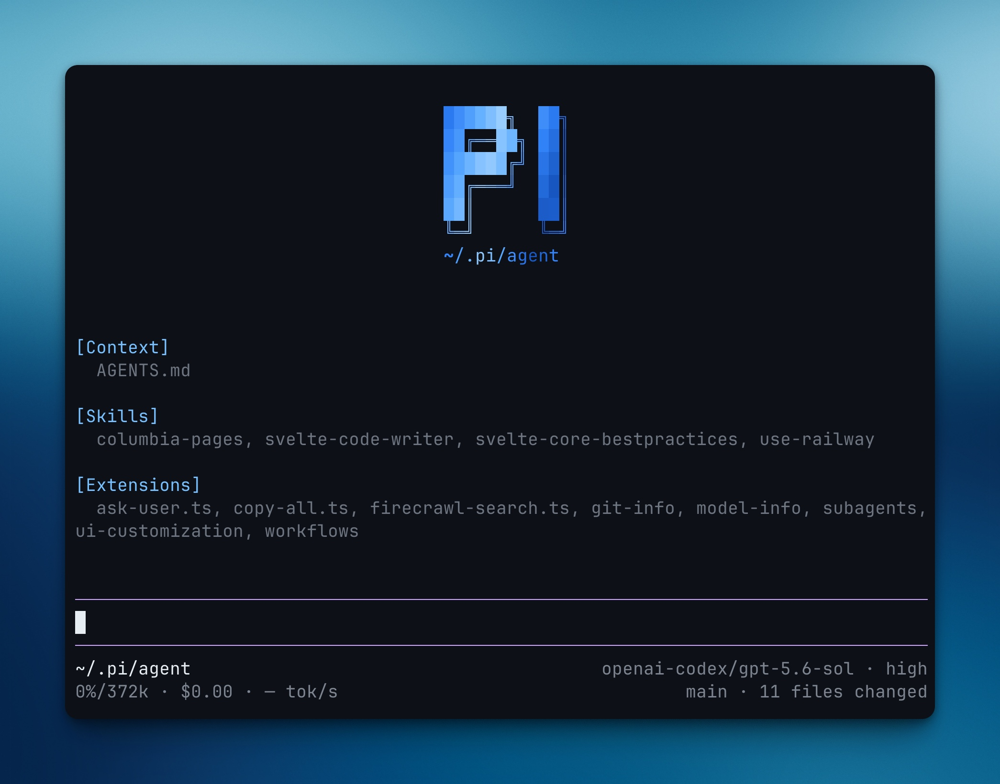

# pi

[](docs/setup.md)
[](docs/development.md)
[](https://bun.sh)
[](https://effect.website/)
[](https://github.com/earendil-works/pi)
[](docs/setup.md#firecrawl)
[](docs/setup.md#theme)
[](https://github.com/dotbrains/pi/commits/main)
[](https://github.com/dotbrains/pi)

Opinionated **Pi agent setup** with local extensions, subagents, workflows,
Firecrawl-backed web tools, Git status UI, managed background terminals, and
bundled dark themes. Clone it into `~/.pi/agent`, add your Firecrawl key, and
Pi loads the extensions, skills, and theme on the next start.

```console
$ git clone https://github.com/dotbrains/pi ~/.pi/agent
$ cd ~/.pi/agent
$ bun install
$ cp .env.example .env       # add FIRECRAWL_API_KEY

# then restart Pi
```



See [docs/setup.md](docs/setup.md) for the full setup flow.

## Extensions

| Extension              | What it does                                             |
| ---------------------- | -------------------------------------------------------- |
| `ask-user`             | Adds a multiple-choice tool for explicit user decisions  |
| `background-terminals` | Starts, tracks, and inspects long-running shell commands |
| `copy-all`             | Copies project context for sharing or handoff            |
| `firecrawl-search`     | Adds Firecrawl search, scrape, and crawl tools           |
| `git-info`             | Shows Git status and changed-file context in the Pi UI   |
| `model-info`           | Displays active model information                        |
| `subagents`            | Runs delegated Claude, Codex, Pi, or stub workers        |
| `ui-customization`     | Applies local Pi UI customizations                       |
| `workflows`            | Runs repeatable local workflows with dashboard state     |

See [docs/extensions/README.md](docs/extensions/README.md) for the extension
inventory.

## Skills

This setup keeps the skill surface small:

| Skill                  | What it does                                       |
| ---------------------- | -------------------------------------------------- |
| `background-terminals` | Guidance for managing background terminal sessions |
| `subagents`            | Guidance for delegating work to Pi subagents       |

See [docs/skills.md](docs/skills.md).

## Configuration

Firecrawl tools require `FIRECRAWL_API_KEY` in `~/.pi/agent/.env`. Bundled
themes can be enabled from `~/.pi/agent/settings.json`:

```json
{
  "theme": "gruvbox-dark"
}
```

Available themes: `github-dark`, `gruvbox-dark`. See
[docs/themes.md](docs/themes.md).

## Development

```sh
bun install
bun run check
bun run test
bun run format:check
```

`bun run test` delegates to the repository test script, which runs deterministic
local tests only. Live Claude and Codex backend checks live in
`extensions/subagents/` behind `bun run test:live`.

See [docs/development.md](docs/development.md) for the contributor commands.
