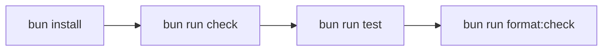

# Development

This repository uses Bun for package management and script execution. The test
script itself uses Node's built-in test runner because the current TypeScript
tests rely on `node --test --experimental-strip-types`.

Install dependencies from the repository root:

```sh
bun install
```

Run the standard checks:

```sh
bun run check
bun run test
bun run format:check
```

CI runs these root checks on every pull request and `main` push. It also walks
each `extensions/*/package.json` and runs the extension-local `check` script,
plus `test` when that extension defines one.

The same extension package audit is available locally:

```sh
bun run check:extensions
```

`lefthook` installs Git hooks from `lefthook.yml` during `bun install`.
Pre-commit runs formatting and type-checks. Pre-push runs the deterministic
root test suite and extension package audit.

Format TypeScript, CommonJS, and JSON files:

```sh
bun run format
```

The root test command runs deterministic local tests only. Live Claude and Codex
backend tests remain available from `extensions/subagents/` with
`bun run test:live`.



## Scripts

| Command                | Purpose                                                           |
| ---------------------- | ----------------------------------------------------------------- |
| `bun run check`        | Type-check the full repository with `tsc --noEmit`.               |
| `bun run test`         | Run deterministic local tests with Node's test runner.            |
| `bun run format`       | Apply Prettier to TypeScript, CommonJS, JSON, and Markdown files. |
| `bun run format:check` | Check formatting without writing changes.                         |

## Extension Packages

Many extensions also have local package scripts. Run them from the extension
directory when working on a single extension:

```sh
cd extensions/background-terminals
bun run check
bun run test
```

Use the root commands before committing because they cover shared code and the
cross-extension test set.

## Test Scope

The root test script includes:

| Area                   | Coverage                                                           |
| ---------------------- | ------------------------------------------------------------------ |
| `background-terminals` | process lifecycle, output capture, kill behavior, dashboard state  |
| `firecrawl-search`     | tool output handling and failure formatting                        |
| `git-info`             | process execution and refresh coordination                         |
| `shared`               | child-session filtering, context usage, tool timeout guards        |
| `subagents`            | manager behavior, result delivery, context usage, takeover UI      |
| `workflows`            | artifacts, controller, metadata parsing, sandboxing, serialization |

Live backend tests are excluded from the root script because they require local
CLI authentication and may call external services.

## Lockfile

`bun.lock` is the canonical dependency lockfile. Do not regenerate
`package-lock.json` unless the project intentionally moves back to npm.
