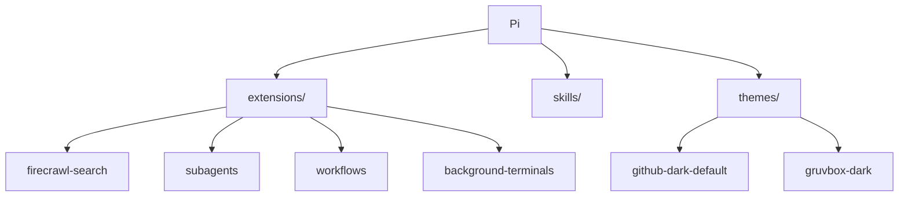
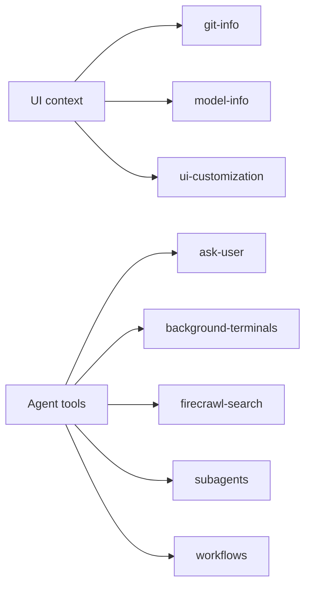

# Extensions

This setup includes local Pi extensions under `extensions/`. Pi loads them from
the agent directory on startup.



## Inventory

| Extension              | Purpose                                                                   |
| ---------------------- | ------------------------------------------------------------------------- |
| `ask-user`             | Adds a multiple-choice prompt tool for agent/user decision points.        |
| `background-terminals` | Runs and monitors long-lived shell commands in managed terminal sessions. |
| `copy-all`             | Copies relevant project context for sharing or handoff.                   |
| `firecrawl-search`     | Adds Firecrawl-backed search, scrape, and crawl tools.                    |
| `git-info`             | Shows Git status and changed-file context in the Pi UI.                   |
| `model-info`           | Displays active model information.                                        |
| `subagents`            | Runs delegated Claude, Codex, Pi, or stub workers from Pi.                |
| `ui-customization`     | Applies local Pi UI customizations.                                       |
| `workflows`            | Runs repeatable local workflow definitions with dashboard state.          |

Each extension has its own `package.json` under `extensions/`.

## Runtime Dependencies

| Extension              | External requirement                                                  |
| ---------------------- | --------------------------------------------------------------------- |
| `firecrawl-search`     | `FIRECRAWL_API_KEY` in `~/.pi/agent/.env`.                            |
| `subagents`            | Optional Claude Code or Codex CLI authentication for those harnesses. |
| `background-terminals` | Host shell access for managed commands.                               |
| `git-info`             | A Git working tree for repository status.                             |
| `workflows`            | Workflow definitions and any tools called by those workflows.         |

## How Extensions Fit Together

`git-info`, `model-info`, and `ui-customization` enrich the Pi interface.
`ask-user`, `background-terminals`, `firecrawl-search`, `subagents`, and
`workflows` add tools that change what an agent can do during a session.



## Working On An Extension

Use the root checks for broad validation. For tight feedback on one extension,
run commands inside that extension directory:

```sh
cd extensions/firecrawl-search
bun run check
bun run test
```

Extensions without a local `test` script are covered by `bun run check` and the
root test suite where applicable.
