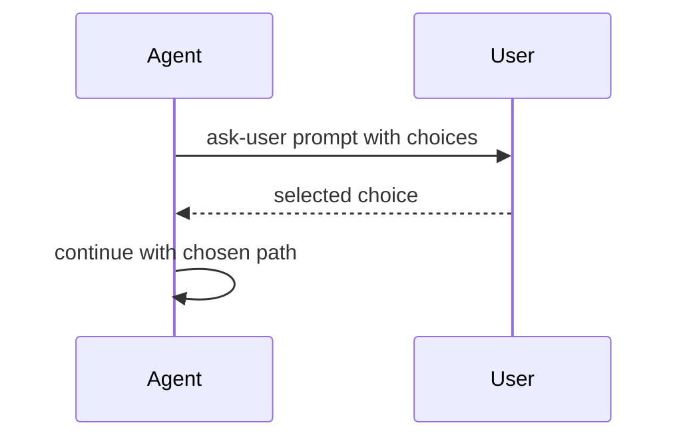

# ask-user

`ask-user` adds an explicit multiple-choice question tool for moments where the
agent should stop and ask the user to choose a path.

## Files

| File                               | Purpose                                      |
| ---------------------------------- | -------------------------------------------- |
| `extensions/ask-user/index.ts`     | Registers the extension and tool.            |
| `extensions/ask-user/prompt.ts`    | Provides model-facing tool guidance.         |
| `extensions/ask-user/package.json` | Declares extension dependencies and scripts. |

## Behavior

Use this extension for bounded decisions, such as selecting one of several
implementation approaches. It is not a free-form chat replacement; the value is
that the agent presents concrete choices and waits for a clear answer.



## Development

```sh
cd extensions/ask-user
bun run check
```
