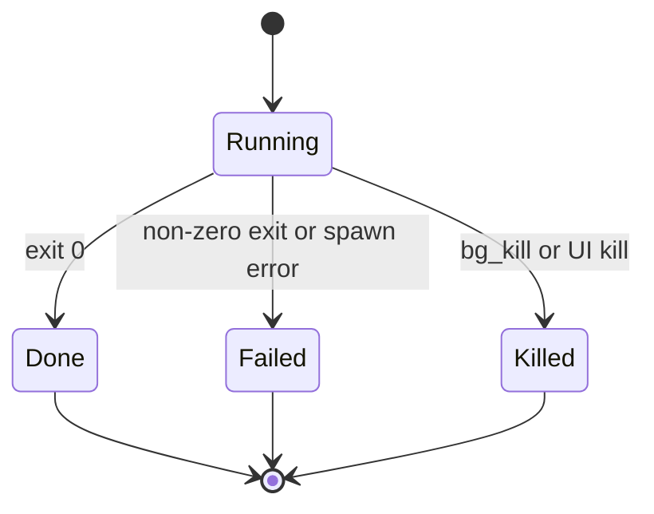

# background-terminals

`background-terminals` runs long-lived shell commands while the agent continues
working. It is built for dev servers, watchers, streaming builds, and commands
that need later inspection.

## Files

| File                                             | Purpose                                        |
| ------------------------------------------------ | ---------------------------------------------- |
| `extensions/background-terminals/index.ts`       | Registers tools and UI integration.            |
| `extensions/background-terminals/src/manager.ts` | Owns process lifecycle state.                  |
| `extensions/background-terminals/src/runtime.ts` | Builds the Effect runtime layer.               |
| `extensions/background-terminals/src/output.ts`  | Captures bounded output views and spill files. |
| `extensions/background-terminals/src/ui/`        | Renders terminal status and output views.      |
| `extensions/background-terminals/src/prompt.ts`  | Provides model-facing usage guidance.          |

## Behavior



The extension ignores stdin, captures stdout and stderr separately, keeps a
bounded in-memory tail, and stores full output in spill files when needed.

## Development

```sh
cd extensions/background-terminals
bun run check
bun run test
```
