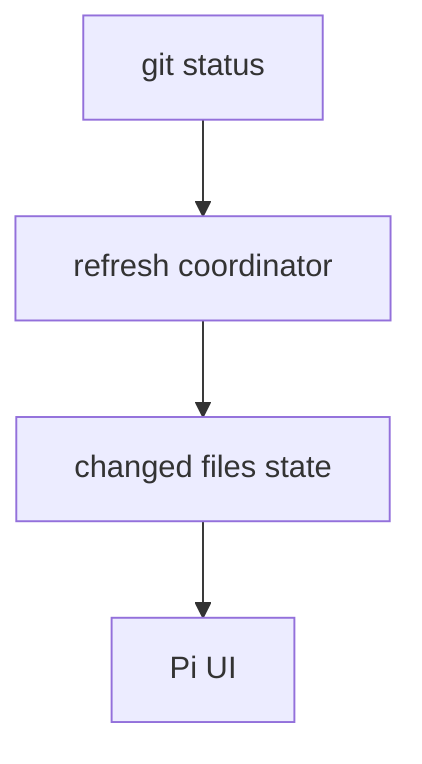

# git-info

`git-info` adds repository status and changed-file context to the Pi UI.

## Files

| File                                             | Purpose                                          |
| ------------------------------------------------ | ------------------------------------------------ |
| `extensions/git-info/index.ts`                   | Registers the extension.                         |
| `extensions/git-info/src/process.ts`             | Runs Git commands with explicit failures.        |
| `extensions/git-info/src/refresh-coordinator.ts` | Coordinates foreground and background refreshes. |
| `extensions/git-info/src/changed-files-view.ts`  | Formats changed-file state for display.          |

## Behavior

The extension expects to run inside a Git working tree. It keeps status context
fresh without making every UI render invoke Git directly.



## Development

```sh
cd extensions/git-info
bun run check
bun run test
```
