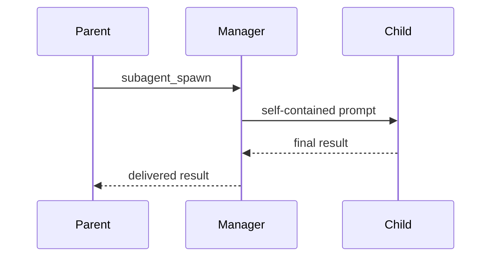

# subagents

`subagents` delegates work to child agents running in Claude, Codex, Pi, or stub
harnesses.

## Files

| File                                          | Purpose                                           |
| --------------------------------------------- | ------------------------------------------------- |
| `extensions/subagents/index.ts`               | Registers tools and UI routes.                    |
| `extensions/subagents/src/manager.ts`         | Owns subagent lifecycle state.                    |
| `extensions/subagents/src/backend.ts`         | Defines the backend interface.                    |
| `extensions/subagents/src/backends/`          | Implements Claude, Codex, Pi, and stub harnesses. |
| `extensions/subagents/src/result-delivery.ts` | Handles deferred result delivery.                 |
| `extensions/subagents/src/ui/`                | Renders takeover and transcript views.            |
| `extensions/subagents/src/prompt.ts`          | Provides model-facing delegation guidance.        |

## Behavior



Subagents have separate context windows and cannot see the parent conversation.
Prompts should include the working directory, constraints, expected output, and
any files the child should inspect.

## Runtime Requirements

| Harness  | Requirement                                        |
| -------- | -------------------------------------------------- |
| `pi`     | Pi model registry available to the parent session. |
| `claude` | Claude Code installed and authenticated.           |
| `codex`  | Codex CLI installed and authenticated.             |
| `stub`   | No external requirement; useful for tests.         |

## Development

```sh
cd extensions/subagents
bun run check
bun run test
```

Live backend tests are available with `bun run test:live`.
