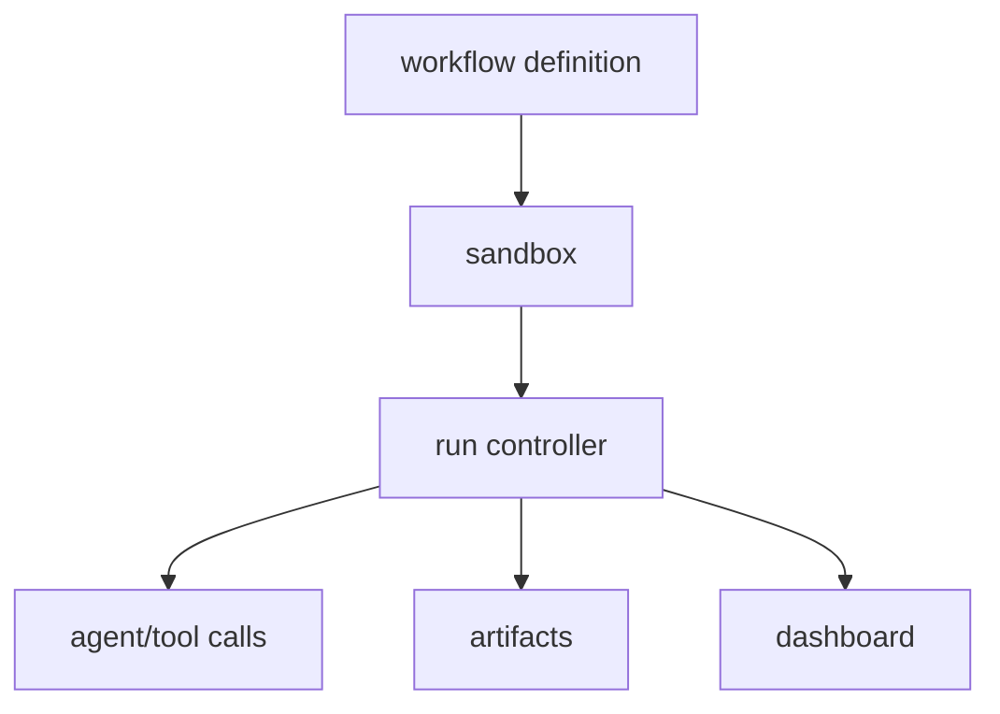

# workflows

`workflows` runs repeatable local workflow definitions with dashboard state,
artifact persistence, cancellation, and sandboxed execution.

## Files

| File                                 | Purpose                                        |
| ------------------------------------ | ---------------------------------------------- |
| `extensions/workflows/index.ts`      | Registers workflow tools and UI integration.   |
| `extensions/workflows/controller.ts` | Coordinates workflow run lifecycle and fanout. |
| `extensions/workflows/runner.ts`     | Runs workflow logic and provider calls.        |
| `extensions/workflows/sandbox.ts`    | Restricts workflow execution capabilities.     |
| `extensions/workflows/artifacts.ts`  | Persists workflow artifacts.                   |
| `extensions/workflows/dashboard.ts`  | Renders workflow dashboard state.              |
| `extensions/workflows/prompt.ts`     | Provides model-facing workflow guidance.       |

## Behavior



The sandbox exposes only workflow-approved capabilities and rejects unsupported
results. The controller caps concurrent calls and propagates cancellation.

## Development

```sh
cd extensions/workflows
bun run check
```

Workflow tests are included in the root `bun run test` command.
