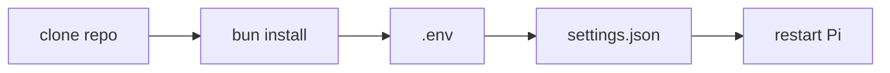

# Setup

This repository is intended to live at `~/.pi/agent`, where Pi can load local
extensions, skills, themes, and configuration.



## Install

Clone or copy this repository, then install dependencies with Bun:

```sh
git clone https://github.com/dotbrains/pi ~/.pi/agent
cd ~/.pi/agent
bun install
```

If the directory already exists, update it in place:

```sh
cd ~/.pi/agent
git pull
bun install
```

## Firecrawl

The search, scrape, and crawl tools require a Firecrawl API key. Follow
[Firecrawl's Node.js getting-started guide](https://docs.firecrawl.dev/quickstarts/nodejs),
then copy the example environment file:

```sh
cp ~/.pi/agent/.env.example ~/.pi/agent/.env
```

Replace the placeholder in `~/.pi/agent/.env` with your API key.

## Theme

Add one of the included themes to `~/.pi/agent/settings.json` while keeping your
existing settings:

```json
{
  "theme": "gruvbox-dark"
}
```

Available themes:

| Theme                 | File                              |
| --------------------- | --------------------------------- |
| `github-dark-default` | `themes/github-dark-default.json` |
| `gruvbox-dark`        | `themes/gruvbox-dark.json`        |

See [themes.md](themes.md) for palette details and theme structure.

## Layout

Pi discovers this setup from the repository directories:

| Path          | Loaded by Pi as                 |
| ------------- | ------------------------------- |
| `extensions/` | local extension modules         |
| `skills/`     | agent skills                    |
| `themes/`     | terminal UI themes              |
| `models.json` | local model metadata            |
| `.env`        | extension environment variables |

Pi loads extensions, skills, and themes from their directories the next time it
starts.

## Troubleshooting

If a Firecrawl tool fails immediately, confirm `FIRECRAWL_API_KEY` is present in
`~/.pi/agent/.env`.

If a theme does not apply, confirm the `theme` value in `settings.json` exactly
matches the theme `name` field, such as `gruvbox-dark`.

If dependencies look stale after pulling updates, rerun `bun install` from
`~/.pi/agent`.
