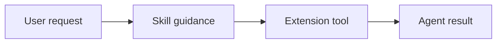

# Skills

Skills live under `skills/` and provide agent-facing operating instructions.
They are loaded separately from extensions: extensions add tools and UI
behavior, while skills teach the agent when and how to use those capabilities.

## Inventory

| Skill                                             | Purpose                                             |
| ------------------------------------------------- | --------------------------------------------------- |
| [`background-terminals`](background-terminals.md) | Guidance for managing background terminal sessions. |
| [`subagents`](subagents.md)                       | Guidance for delegating work to Pi subagents.       |

## How To Read These Docs

Each skill page documents:

- when the skill should trigger
- which extension tools it expects to use
- what constraints the agent should follow
- where the source `SKILL.md` lives

The source of truth for agent behavior remains the matching file under
`skills/`. The docs explain that behavior for maintainers and users.
