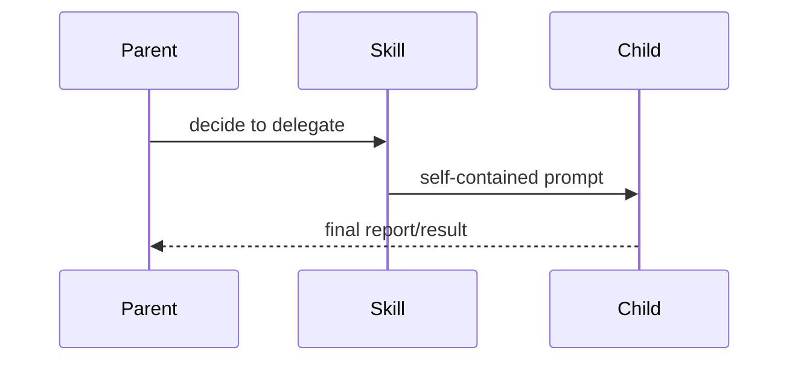

# subagents

The `subagents` skill teaches the agent how to delegate work to child agents
running in separate context windows.

## Source

| Path                        | Purpose                                                 |
| --------------------------- | ------------------------------------------------------- |
| `skills/subagents/SKILL.md` | Agent-facing skill instructions.                        |
| `extensions/subagents/`     | Tool, harness, and UI implementation used by the skill. |

## When It Applies

Use this skill when work can be isolated into a self-contained task, such as
parallel code investigation, focused review, or implementation work that does
not require direct user interaction.

Do not use subagents for tasks that require the child to ask the user questions.
Children cannot see the parent conversation unless the prompt includes the
needed context.

## Harnesses

| Harness  | Use                                                         |
| -------- | ----------------------------------------------------------- |
| `pi`     | Default harness when the user does not request another one. |
| `claude` | Claude Code-backed child agent.                             |
| `codex`  | Codex CLI-backed child agent.                               |
| `stub`   | Test harness with no external CLI requirement.              |

## Prompt Requirements

Every child prompt should include:

- task objective
- working directory
- relevant files or paths
- constraints and exclusions
- expected report format
- whether edits are allowed

## Tool Mapping

| Tool              | Purpose                                                |
| ----------------- | ------------------------------------------------------ |
| `subagent_spawn`  | Start a child run with a self-contained prompt.        |
| `subagent_check`  | Peek at a run without blocking.                        |
| `subagent_list`   | List active and completed child runs.                  |
| `subagent_wait`   | Block until selected child results are needed.         |
| `subagent_cancel` | Stop selected child runs while preserving transcripts. |
| `/subagents`      | Inspect or take over a run interactively.              |

## Constraints

At most four subagents run concurrently. After spawning, the parent should
continue useful work instead of immediately waiting unless the result is needed
to proceed.
