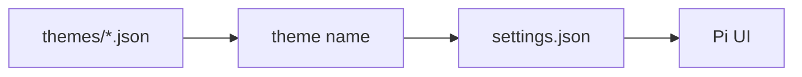

# Themes

Themes live under `themes/` and are selected by name from
`~/.pi/agent/settings.json`.



## Available Themes

| Theme          | Palette                           | File                       |
| -------------- | --------------------------------- | -------------------------- |
| `github-dark`  | GitHub dark colors                | `themes/github-dark.json`  |
| `gruvbox-dark` | Gruvbox dark hard-inspired colors | `themes/gruvbox-dark.json` |

## Enable A Theme

Set the `theme` value to the theme name:

```json
{
  "theme": "gruvbox-dark"
}
```

Restart Pi after changing the theme.

## Theme Structure

Each theme has three top-level sections:

| Section  | Purpose                                                          |
| -------- | ---------------------------------------------------------------- |
| `vars`   | Named palette values used by the theme.                          |
| `colors` | Pi UI color roles mapped to palette values or direct hex colors. |
| `export` | Colors used by exported or rendered views.                       |

Prefer adding reusable colors to `vars` first, then referencing them from
`colors`. Use direct hex values only for one-off UI states.
